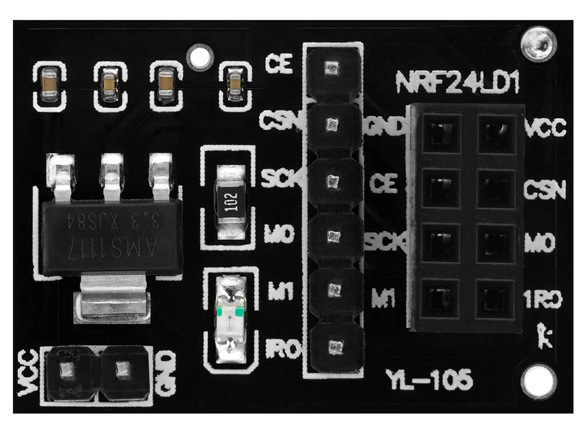
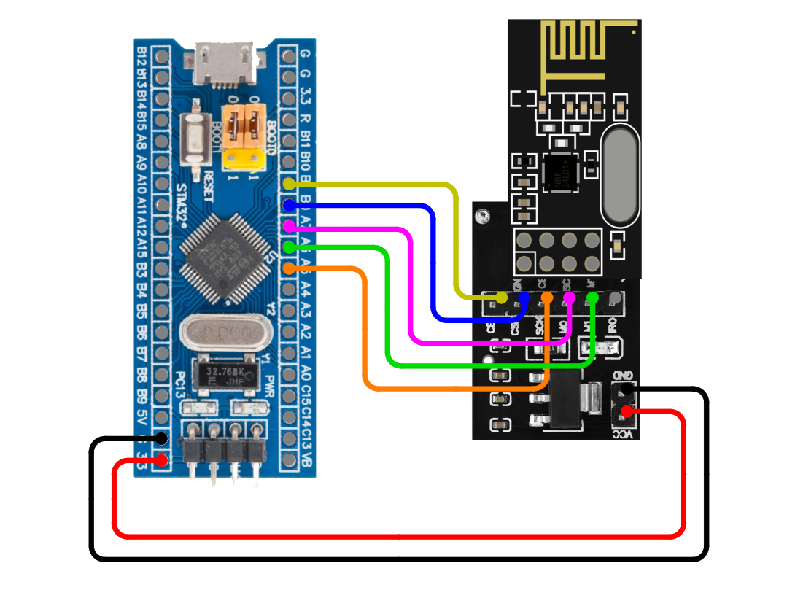

# stm32-nrf24l01

<a target="_blank" href="https://www.paypal.com/donate/?hosted_button_id=J65KNQYEK88ML">
  
</a>

STM32 C library for the nRF24L01 wireless RF transceiver. Also compatible with nRF24L01+.

## How to connect

**Note** that for stability purposes, it is recommended to add 2 capacitors (electrolytic 10uF and ceramic 0.1uF) between VCC and GND of the nRF24L01 module. Alternatively, you can use a dedicated nRF24L01 Breakout Adapter board that includes the necessary capacitors and a voltage regulator which allows powering the nRF24L01 module from a 5V source, instead of 3.3V.



In order to connect the nRF24L01 module to the STM32F103C8T6 board (blue pill), use the following connections.

<table>
  <tr>
    <td><b>STM32</b></td>
    <td><b>nRF24L01</b></td>
  </tr>
  <tr>
    <td>B0</td>
    <td>CSN</td>
  </tr>
  <tr>
    <td>B1</td>
    <td>CE</td>
  </tr>
  <tr>
    <td>3.3</td>
    <td>VCC</td>
  </tr>
  <tr>
    <td>G</td>
    <td>GND</td>
  </tr>
  <tr>
    <td>A5</td>
    <td>SCK</td>
  </tr>
  <tr>
    <td>A6</td>
    <td>MISO</td>
  </tr>
  <tr>
    <td>A7</td>
    <td>MOSI</td>
  </tr>
</table>

Note that SCK, MOSI and MISO pins are connected to the SPI1 pins. Pins from other SPI peripherals could also be used. CSN and CE pins are assigned to arbitrary GPIO pins and can be changed as needed.  
A similar connection scheme can be used for other STM32 boards.



In the image above, a breakout adapter board is used.

## How to install

### Step 1

Initialize following (either using CubeMX or manually):
- The SPI peripheral
  - Mode: Full-Duplex Master
  - Prescaler: Any value that results in a baud rate higher than 2MB/s
  - First Bit: MSB First
- CSN, CE pins configured as outputs

### Step 2

Include the library to your project by copying the `stm32-nrf24l01` folder to `project_root/Drivers`.

### Step 3

Link the library files to the project.  
In STM32CubeIDE navigate to `Project -> Properties -> C/C++ General -> Paths and Symbols`. Then, select the include tab, click *Add*, then click *Workspace* and select the `Drivers/stm32-nrf24l01/Inc` folder.  

### Step 4

Create a `stm32_hal.c` file in your project and implement the functions of the following template. These function implementations depend on the HAL library and the specific STM32 microcontroller being used. Here is an [example](examples/stress-test/App/Src/stm32_hal.c) for the STM32F103C8T6 (blue pill) MCU.

```c
#include "stm32_hal.h"

#include "stm32xxxx_hal.h"

void stm32_hal_write_pin(void *port, uint16_t pin, bool value) {
    
}

uint8_t stm32_hal_spi_transmit(void *spi, const uint8_t *data, uint16_t size, uint32_t timeout) {
    
}

uint8_t stm32_hal_spi_receive(void *spi, uint8_t *data, uint16_t size, uint32_t timeout) {
    
}

uint32_t stm32_hal_get_sys_tick_val() {
    
}

uint32_t stm32_hal_get_sys_tick_load() {
    
}

uint32_t stm32_hal_get_system_core_clock() {
    
}

uint32_t stm32_hal_get_tick() {
    
}
```

### Step 5

Include the library with `#include "nrf24l01.h"`. Done!

## How to use

**See the examples folder for complete projects**

Initialize and power up a nRF24L01 device.

```c
#include "nrf24l01.h"

// Initialize the nRF24L01 device connected to SPI1, B0 as CSN and B1 as CE. The address
// prefix can be any 4-byte array. Transmitter and receiver devices must share the same
// address prefix to communicate.
nrf24l01 device;
uint8_t address_prefix[4] = {0xB3, 0xB4, 0xB5, 0xB6};
if (!nrf24l01_init(&device, address_prefix, &hspi1, GPIOB, GPIO_PIN_0, GPIOB, GPIO_PIN_1)) {
    printf("Could not initialize device\r\n");
}

// Power up the device.
nrf24l01_power_up(&device);
```

Optionally, apply settings to the device.

```c
// Set RF channel to 32.
nrf24l01_set_channel(&device, 32);

// Set data rate to 2Mbps.
nrf24l01_set_data_rate(&device, DATA_RATE_HIGH);

// Set transmission power to low.
nrf24l01_set_power_level(&device, POWER_LEVEL_LOW);

// Configure auto retransmit in case of failed transmission with delay of 1000us and maximum 5 retransmits.
nrf24l01_set_retransmit_delay(&device, 3);
nrf24l01_set_retransmit_count(&device, 5);

// Use 2 bytes for the CRC.
set_crc_bytes(&device, CRC_BYTES_2);
```

Configure device for packet transmission (Transmit and receive addresses must match)

```c
nrf24l01_set_pipe0_write(&device, 0x15);
```

Configure device for packet reception on pipe 1 (Transmit and receive addresses must match)

```c
nrf24l01_set_pipe_read(&device, 1, 0x15);
```

Send packets

```c
uint8_t packet0[32] = "Hello, World!";
uint8_t packet1[32];
packet1[0] = 42;
uint8_t *packets[2] = {packet0, packet1};
uint8_t payload_lengths[2] = {32, 32};

// Send a single packet with retransmission on failure.
nrf24l01_send_packet(&device, packet0, true);

// Send a single packet without retransmission on failure.
nrf24l01_send_packet(&device, packet0, false);

// Send multiple packets in a row.
nrf24l01_send_packets(&device, packets, 2, payload_lengths, true);

// Send multiple packets in a row without acknowledgments.
nrf24l01_send_packets_no_ack(&device, packets, 2, payload_lengths);
```

Receive packets

```c
uint8_t packet0[32];
uint8_t packet1[32];
uint8_t *packets[2] = {packet0, packet1};

// Receive a single packet with 100ms timeout.
nrf24l01_receive_packet(&device, packet0, 100);

// Receive multiple packets in a row with 100ms timeout for each packet
// except for the first which does not have a timeout.
nrf24l01_receive_packets(&device, packets, 2, 100)
```

Receive a stream of packets indefinitely

```c
void value_callback(uint8_t *packet, uint8_t packet_length) {
    printf("Received a packet with size %d\r\n", packet_length);
    // Process the packet data...
}

nrf24l01_receive_packets_inf(&device, value_callback);
```

## Features

## Resources

- [nRF24L01+ Product Specification v1.0](https://docs.nordicsemi.com/bundle/nRF24L01P_PS_v1.0/resource/nRF24L01P_PS_v1.0.pdf)
